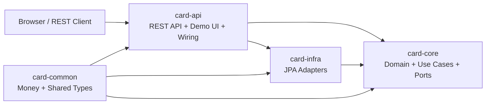

# card-mizer

카드 실적, 혜택 정책, 우선순위를 계산해 결제 카드를 추천하는 Java/Spring 백엔드 데모입니다.

## Problem

여러 장의 카드를 함께 쓰면 이번 달 실적이 어디까지 찼는지, 다음 결제를 어느 카드에 태워야 유리한지 매번 직접 계산해야 합니다. `card-mizer`는 이 판단 비용을 줄이기 위해, 실적 추적과 추천 로직을 도메인 모델 중심으로 풀어내는 프로젝트입니다.

## What This Repository Proves

- Java/Spring 기반 도메인 로직 설계 및 구현 역량
- 헥사고날 아키텍처와 Gradle 멀티모듈 적용 능력
- 단순 CRUD보다 도메인 판단 로직이 중심인 백엔드 모델링
- 거래 정규화와 카드 혜택 규칙 모델링 능력
- 문서와 테스트로 설계 근거를 남기는 습관

## Current State

- `card-core`에서 사용 내역 기록, 실적 조회, 결제 추천, 카드 등록, 우선순위 조정, 카드 정책 조회/교체 유스케이스를 구현했습니다.
- `card-api`에서 REST API와 정적 데모 UI를 함께 제공합니다.
- `card-infra`는 현재 JPA/H2 기반 어댑터와 시드 데이터로 동작합니다.
- 스키마는 Flyway migration으로 관리하고, 기본 프로파일은 `h2`입니다.
- 신규 카드 등록 시 기본 실적 정책을 함께 생성해 추천/실적 조회 흐름이 깨지지 않도록 맞췄습니다.
- 가맹점/태그 정규화 규칙과 추천 시나리오는 YAML fixture로 관리합니다.
- `./gradlew test` 기준 단위 테스트가 통과합니다.

## Architecture Snapshot



현재 기준선에서는 `card-api`가 시연과 조립을 맡고, 핵심 추천 규칙은 `card-core`에 남겨 두며, 저장과 시드 데이터는 `card-infra`의 JPA 어댑터가 담당합니다.

## Demo Flow

브라우저에서 `http://localhost:8080`에 접속하면 다음 흐름을 바로 시연할 수 있습니다.

1. 추천 시나리오 선택
2. 추천 요청값 자동 채움
3. 추천 실행
4. 추천 카드와 대안 카드 확인
5. 같은 월의 실적 현황 조회

기본 시나리오는 다음 4개가 준비돼 있습니다.

- `K-패스 실적 달성과 대중교통 할인`
- `노리2 영화 할인과 KB Pay 추가 할인 중첩`
- `My WE:SH 노는데 진심과 OTT 할인`
- `현대 ZERO 포인트형 온라인 간편결제`

## Quick Start

```bash
./gradlew test
./gradlew :card-api:bootRun
```

- 데모 UI: `http://localhost:8080`
- 추천 시나리오 API: `GET /api/demo-scenarios/recommendations`

PostgreSQL로 실행하려면 저장소의 로컬 PostgreSQL을 먼저 띄운 뒤 `postgres` 프로파일로 부팅하면 됩니다.

```bash
docker compose up -d
./gradlew :card-api:bootRun --args='--spring.profiles.active=postgres'
```

기본 연결 정보는 `jdbc:postgresql://localhost:55432/cardmizer`, `cardmizer/cardmizer` 입니다. 다른 DB를 쓰려면 `CARD_MIZER_DB_URL`, `CARD_MIZER_DB_USERNAME`, `CARD_MIZER_DB_PASSWORD`를 덮어쓰면 됩니다.

## API Surface

| Endpoint | Purpose |
|------|------|
| `GET /api/demo-scenarios/recommendations` | 데모 시나리오 목록과 기본 요청값 조회 |
| `POST /api/recommendations` | 결제 금액 기준 추천 카드 계산 |
| `GET /api/performance-overview?yearMonth=YYYY-MM` | 월별 카드 실적 현황 조회 |
| `POST /api/spending-records` | 수동 사용 내역 저장 |
| `POST /api/cards` | 카드 등록과 기본 실적 정책 생성 |
| `PATCH /api/cards/priorities` | 등록된 카드 전체의 우선순위 재정렬 |
| `GET /api/cards/{cardId}/performance-policy` | 카드별 실적/혜택 정책 조회 |
| `PUT /api/cards/{cardId}/performance-policy` | 카드별 실적/혜택 정책 전체 교체 |
| `PATCH /api/cards/{cardId}/performance-policy` | 카드별 실적/혜택 정책 일부 필드만 교체 |

## Example Request

아래 예시는 시드 시나리오 중 `kpass-transit-threshold`를 그대로 호출하는 요청입니다.

```bash
curl -X POST http://localhost:8080/api/recommendations \
  -H 'Content-Type: application/json' \
  -d '{
    "spendingMonth": "2026-03",
    "amount": 20000,
    "merchantName": "서울교통공사",
    "merchantCategory": "대중교통",
    "paymentTags": []
  }'
```

```json
{
  "recommendedCardId": "SAMSUNG_KPASS",
  "recommendedCardName": "삼성카드 K-패스 삼성카드",
  "reason": "삼성카드 K-패스 삼성카드 KPASS_40 구간까지 20,000원 남아 있어 이번 결제로 바로 달성할 수 있습니다. 예상 혜택은 2,000원(대중교통 10% 결제일할인)입니다.",
  "alternatives": [
    {
      "cardId": "HYUNDAI_ZERO_POINT",
      "cardName": "현대카드 ZERO Edition2(포인트형)",
      "reason": "...",
      "score": 0
    }
  ]
}
```

위 응답 예시는 필드 구조 설명용으로 일부 대안 항목을 축약했습니다.

## Example Overview Response

```bash
curl "http://localhost:8080/api/performance-overview?yearMonth=2026-03"
```

```json
[
  {
    "cardId": "SAMSUNG_KPASS",
    "cardName": "삼성카드 K-패스 삼성카드",
    "priority": 1,
    "spentAmount": 380000,
    "targetAmount": 400000,
    "remainingAmount": 20000,
    "achieved": false,
    "targetTierCode": "KPASS_40"
  }
]
```

## Normalization Rules

입력은 그대로 쓰지 않고 API 계층에서 먼저 정규화합니다.

- `merchantCategory: "대중교통"` -> `PUBLIC_TRANSIT`
- `merchantName: "CGV 왕십리"` -> `MOVIE`
- `paymentTags: ["KB Pay"]` -> `KB_PAY`
- 카테고리와 태그를 합쳐 `ONLINE`, `OFFLINE`, `SUBSCRIPTION`, `SIMPLE_PAY_ONLINE` 같은 파생 태그도 계산합니다.

이 단계 덕분에 추천 엔진은 카드사/가맹점 표현 차이보다 도메인 규칙 자체에 집중할 수 있습니다.

## Architecture At A Glance

- `card-common`: 공통 값 객체와 공통 타입
- `card-core`: 도메인 모델, 유스케이스, 포트
- `card-api`: REST API, 정규화, 데모 시나리오, 정적 UI, 조립 루트
- `card-infra`: 현재 JPA 기반 영속성 어댑터
- `db/migration`: Flyway schema migration

현재 구조는 "실행 가능한 데모를 먼저 만들고, 이후 persistence adapter를 교체하는" 흐름에 맞춰져 있습니다. 핵심 추천 로직은 `card-core`에 남겨 두고, 시연용 요소와 프레임워크 의존성은 바깥으로 밀어냈습니다.

## Testing

- `RecommendCardServiceTest`: 실적 달성 우선과 혜택 우선이 섞이는 추천 규칙 검증
- `GetPerformanceOverviewServiceTest`: 월별 실적 집계와 다음 목표 구간 계산 검증
- `TransactionNormalizerTest`: 가맹점/태그 정규화 규칙 검증
- `RecommendationDemoScenarioFixtureTest`: YAML 시나리오가 기대한 추천 결과를 실제로 만드는지 검증

## Deferred Work

- 카드 목록 전용 조회 API 추가
- 정책 편집 UI를 JSON 에디터보다 구조화된 UX로 고도화
- 운영용 PostgreSQL 설정과 마이그레이션 전략 정리
- 카드사 API 연동과 알림 어댑터
- 통합 테스트와 API 문서 고도화

## Stack

- Java 17
- Spring Boot 3.4
- Gradle Multi-module
- Spring Web
- Static HTML/CSS/JS demo
- JUnit 5

## Docs

- `PROJECT_PLAN.md`: 현재 결정 사항 요약
- `docs/product-overview.md`: 이름 후보, 포지셔닝, MVP 범위
- `docs/domain-model.md`: 핵심 도메인 모델
- `docs/architecture.md`: 헥사고날 아키텍처 설명
- `docs/module-structure.md`: 모듈/패키지 구조
- `docs/adr/README.md`: ADR 목록과 상태
- `docs/delivery-plan.md`: 다음 마일스톤과 작업 큐
- `docs/work-log-2026-03-31.md`: 2026-03-31 구현/검증 복기 노트

## Status

현재 기준선은 "문서만 있는 설계 저장소"가 아니라 "Flyway + JPA/H2 기반으로 동작하는 추천/관리 데모"입니다. 다음 단계는 입력 안정성 보강, 카드 정책 편집 UX 보강, PostgreSQL 운영 환경 정리로 구조를 다듬는 것입니다.
