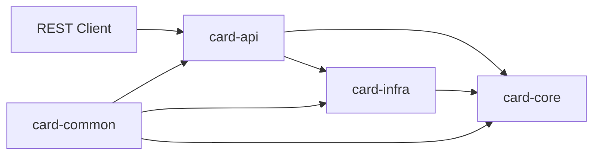

# Architecture

## Goal

`card-mizer`는 카드 실적 추적과 결제 카드 추천을 도메인 중심으로 풀어내는 백엔드다. 핵심 관심사는 "어떤 카드를 지금 써야 하는가"를 계산하는 판단 로직이며, 외부 시스템은 이 판단을 지원하는 주변 요소다.

## Why Hexagonal

- 추천 엔진은 REST API, 스케줄러, 이후 배치나 CLI에서도 재사용될 수 있다.
- 초기에는 수동 입력 기반으로 시작하지만, 이후 카드사 연동이나 알림 어댑터를 붙일 가능성이 있다.
- 실적 구간, 우선순위, 혜택 규칙은 프레임워크보다 도메인 모델에 가까운 문제다.

## Module Interaction

## Dependency Rules

- `card-core`는 순수 Java 모듈로 유지하고 Spring/JPA에 의존하지 않는다.
- `card-api`는 inbound adapter이자 조립 루트로 동작하며, core와 infra를 스프링 빈으로 연결한다.
- `card-infra`는 outbound port 구현만 담당하고 추천 정책을 소유하지 않는다.
- 공통 값 객체는 `card-common`에 두되, 비즈니스 규칙은 `card-core`로 올린다.

## Entry Points

- REST API: 카드 등록, 실적 조회, 결제 추천
- Static demo UI: 추천 요청과 실적 조회를 시연하는 단일 화면
- Scheduler: 월간 마감 및 기간 전환
- Admin or batch entry point: 초기 데이터 적재, 정책 갱신

## Current Adapters

- Persistence adapter: 인메모리 카드 카탈로그, 카드 정책, 사용 내역 저장
- Manual input adapter: REST 요청 기반 사용 내역 입력
- Rule loader adapter: YAML 기반 가맹점 정규화 규칙과 데모 시나리오 로딩
- Demo adapter: Spring Boot static resources로 제공되는 시연 화면

## Deferred Adapters

- Persistence adapter: PostgreSQL + JPA
- Card company adapter: 후속 단계의 카드사별 조회 연동
- Notification adapter: 실적 임박 또는 추천 결과 알림

## Design Constraints

- 현재 기준선은 수동 입력, 실적 조회, 추천 계산을 인메모리로 설명 가능하게 만드는 데 집중한다.
- 고성능 분산 아키텍처보다 설계 설명 가능성과 테스트 용이성을 우선한다.
- 외부 연동이 추가되더라도 core 모듈의 도메인 인터페이스는 유지되어야 한다.
- `card-api`는 현재 조립 루트 역할과 데모 시연 책임을 함께 가진다.
